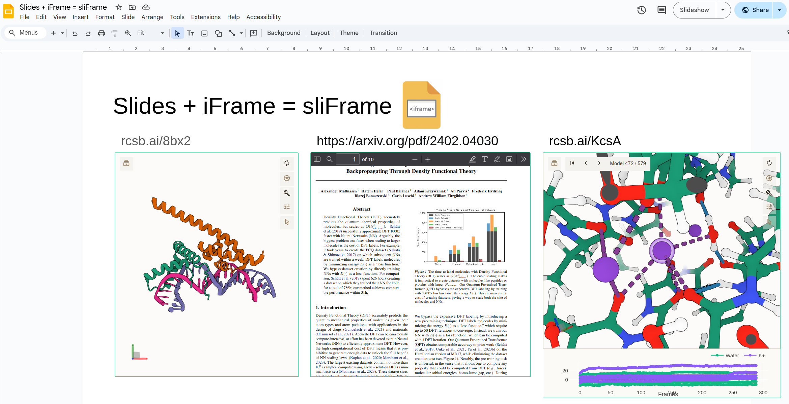

# Add Iframe to Google Slides 

A Chrome extension that allows you to add Iframes to Google Slides. 

# Installation 

1. Download/unzip <a href='https://logmd.b-cdn.net/public/bundle.zip' target='_blank'>bundle.zip</a>
2. Go to chrome://extensions/
3. Make sure "Developer mode" is on  
4. Click "Load unpacked"
5. Select the `bundle/` folder. 

You need developer mode because Google Store won't publish extensions that inject HTML with JS (we don't know of another way to add the iframes). 

If know a workaround please let us know and we'll fix this <a href='https://calendly.com/alexander-mathiasen/vchat'>immediately</a>. 

If you're from Google, please just add Iframes to Google Slides - huge missing feature everyone wants it. 

## Known Bugs 

[ ] need to refresh after deleting slides 

[ ] presenter mode loads from scratch 

[ ] sometimes have to do pre/next slide  to update. 

## License

MIT
